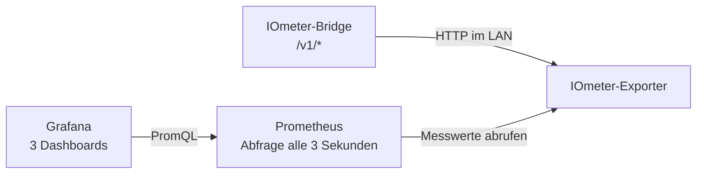

# ⚡ IOmeter Dashboard

Ein sofort startbarer Monitoring-Stack für die lokale IOmeter-API:

- 📡 Ein fertiges Exporter-Image aus der GitHub Container Registry liest `/v1/reading`, `/v1/json` und optional `/v1/status`.
- 🗄️ Prometheus speichert die Messwerte standardmäßig 90 Tage.
- 📊 Grafana wird automatisch mit Datenquelle und drei fertigen Dashboards eingerichtet.

Es sind weder manuelle Grafana-Einstellungen noch eine Cloud-Verbindung erforderlich.



## 🚀 Schnellstart

Benötigt werden Docker Engine beziehungsweise Docker Desktop mit Docker Compose.

Zuerst das Repository laden und die lokale Konfiguration anlegen:

```bash
git clone https://github.com/DasCanard/iometer-dashboard.git
cd iometer-dashboard
cp .env.example .env
```

Anschließend `IOMETER_HOST` in `.env` auf die IP-Adresse oder einen per DNS auflösbaren Hostnamen der eigenen Bridge setzen:

```dotenv
IOMETER_HOST=iometer.local
```

Danach den Stack starten:

```bash
docker compose up -d
```

Compose lädt den IOmeter-Exporter automatisch als `ghcr.io/dascanard/iometer-dashboard:latest`. Ein lokaler Image-Build ist für den Betrieb nicht erforderlich. Das Repository wird weiterhin benötigt, weil es die Compose-Datei sowie die provisionierten Prometheus- und Grafana-Konfigurationen enthält.

Die Oberflächen sind anschließend hier erreichbar:

- Grafana: [http://localhost:3000](http://localhost:3000)
- Prometheus: [http://localhost:9090](http://localhost:9090)

Die initialen Grafana-Zugangsdaten lauten `admin` / `admin`, sofern sie nicht in `.env` geändert wurden. Vor einer Freigabe außerhalb eines vertrauenswürdigen lokalen Netzes muss `GRAFANA_ADMIN_PASSWORD` vor dem ersten Start auf ein starkes Passwort gesetzt werden.

## 📸 Screenshots

| Live-Übersicht | Energie & Lastprofil | Gerätegesundheit |
| :---: | :---: | :---: |
|  |  |  |

## 📊 Dashboards

### IOmeter · Übersicht

Die Live-Übersicht zeigt:

- Erreichbarkeit des IOmeter und Alter des letzten Messwerts,
- den aktuellen Energiefluss als eindeutige Live-Leistungsanzeige,
- das vom IOmeter gelieferte Kurzzeitmittel,
- durchschnittliche Bezugs- und Einspeiseleistung für den gewählten Zeitraum,
- Leistung und Energiefluss im Zeitverlauf,
- kumulierte Zählerstände,
- Zustand aller drei lokalen API-Endpunkte.

### IOmeter · Energie & Lastprofil

Die historische Analyse enthält:

- Netzbezug, Einspeisung und Netto-Energie für den gewählten Zeitraum,
- mittlere Leistung sowie Bezugs- und Einspeisespitzen,
- Momentanleistung und 15-Minuten-Mittel,
- rollierende 24-Stunden-Energie,
- Zählerstände im Zeitverlauf,
- alle vom Stromzähler gelieferten OBIS-Rohregister.

### IOmeter · Gerätegesundheit

Die Diagnoseansicht trennt Fehler entlang der gesamten Messkette:

- Prometheus → Exporter,
- Exporter → IOmeter,
- `/v1/reading`, `/v1/json` und `/v1/status`,
- Messwertalter und API-Abfragedauer,
- Fehlerverlauf und HTTP-Status,
- Funkqualität, Akku, Core-Zustand und Firmware, sofern `/v1/status` diese Daten liefert.

## ⚙️ Konfiguration

Alle Laufzeitwerte werden aus `.env` gelesen:

| Variable | Standard/Beispiel | Bedeutung |
| --- | --- | --- |
| `IOMETER_HOST` | erforderlich | IP-Adresse oder DNS-Hostname der Bridge |
| `IOMETER_SCHEME` | `http` | `http` oder `https` |
| `IOMETER_PORT` | `80` | API-Port |
| `IOMETER_TIMEOUT_SECONDS` | `3` | Zeitlimit je API-Abfrage |
| `GRAFANA_PORT` | `3000` | Grafana-Port auf dem Docker-Host |
| `PROMETHEUS_PORT` | `9090` | Prometheus-Port auf dem Docker-Host |
| `GRAFANA_ADMIN_USER` | `admin` | initialer Grafana-Administrator |
| `GRAFANA_ADMIN_PASSWORD` | `admin` | initiales Grafana-Passwort |
| `PROMETHEUS_RETENTION` | `90d` | Aufbewahrungsdauer der Messhistorie |

`IOMETER_HOST` akzeptiert außerdem einen vollständigen Ursprung wie `https://iometer.example:8443`. Ein darin angegebener Port hat Vorrang vor `IOMETER_PORT`.

Nach Änderungen an `.env` wird die Konfiguration so übernommen:

```bash
docker compose up -d
```

### Prometheus-Aufbewahrungsdauer

`PROMETHEUS_RETENTION` legt fest, wie lange Prometheus die Messhistorie im benannten Docker-Volume aufbewahrt. Unterstützt werden die Einheiten `y`, `w`, `d`, `h`, `m`, `s` und `ms`.

| Gewünschte Dauer | Einstellung in `.env` |
| --- | --- |
| 90 Tage | `PROMETHEUS_RETENTION=90d` |
| 1 Jahr | `PROMETHEUS_RETENTION=1y` oder `PROMETHEUS_RETENTION=365d` |
| 2 Jahre | `PROMETHEUS_RETENTION=2y` oder `PROMETHEUS_RETENTION=730d` |
| 10 Jahre | `PROMETHEUS_RETENTION=10y` |

Ein Prometheus-Jahr ist immer genau 365 Tage lang; Schaltjahre werden dabei nicht berücksichtigt.

Die lokale Prometheus-Datenbank besitzt keinen echten Modus für unbegrenzte Aufbewahrung. Ein leerer Wert verwendet in diesem Stack wieder den Standard von `90d`; `0` beziehungsweise `0s` bedeutet ebenfalls nicht „unbegrenzt“. Ohne wirksame Zeit- oder Größenregel fällt Prometheus auf seine eigene Standardaufbewahrung von 15 Tagen zurück.

Für eine praktisch unbegrenzte lokale Historie kann ein bewusst sehr großer Wert gesetzt werden:

```dotenv
PROMETHEUS_RETENTION=100y
```

Damit wird die Festplattenkapazität zur tatsächlichen Grenze. Der freie Speicher des Docker-Volumes sollte deshalb überwacht und regelmäßig gesichert werden. Für dauerhaft wachsende Installationen ist eine realistische Aufbewahrungsdauer oder ein externes Langzeitspeichersystem sicherer als eine formal sehr große Zeitspanne.

Beim Verkürzen der Aufbewahrungsdauer entfernt Prometheus abgelaufene Datenblöcke im Hintergrund; das kann bis zu etwa zwei Stunden dauern. Gelöschte Messwerte lassen sich durch eine spätere Verlängerung nicht wiederherstellen.

## 🧩 Metrikmodell

Der Exporter bildet bekannte OBIS-Werte auf stabile Prometheus-Metriken ab. Zusätzlich wird jedes Register generisch als `iometer_register_value{obis="…", unit="…"}` bereitgestellt. Weitere Tarife oder Phasenwerte erscheinen dadurch ohne Exporter-Änderung in Prometheus und in der Rohregister-Tabelle.

| Prometheus-Metrik | Quelle | Bedeutung |
| --- | --- | --- |
| `iometer_power_watts` | OBIS `01-00:10.07.00*ff` | Nettoleistung; positiv = Netzbezug, negativ = Einspeisung |
| `iometer_power_average_watts` | `/v1/json` | vom IOmeter geliefertes Kurzzeitmittel der Nettoleistung |
| `iometer_energy_import_watthours_total` | OBIS `01-00:01.08.00*ff` | kumulierter Netzbezug |
| `iometer_energy_export_watthours_total` | OBIS `01-00:02.08.00*ff` | kumulierte Einspeisung |
| `iometer_reading_age_seconds` | Zeitstempel aus `/v1/reading` | Alter des letzten Zählermesswerts |
| `iometer_endpoint_up` | alle API-Endpunkte | gültige JSON-Antwort je Endpunkt |
| `iometer_status_available` | `/v1/status` | optionale Statusdaten sind verfügbar |

Die Energiezähler werden als Prometheus-Counter exportiert. Zeitraum-Summen in den Dashboards verwenden `increase(...)`; dadurch werden auch Zähler- oder Geräteneustarts berücksichtigt.

### Messwertalter und IOmeter-Aktualisierungsintervall

In der IOmeter-App lässt sich das Messintervall beispielsweise auf Echtzeit, eine Minute oder 15 Minuten einstellen. Ein größeres Messwertalter ist deshalb nicht automatisch ein Fehler.

Die Dashboards zeigen den aktuellen Wert und seinen Verlauf bewusst mit neutralen Farben und ohne feste Warnschwellen. So lässt sich die beobachtete Aktualisierung mit dem individuell eingestellten Intervall vergleichen. Die Erreichbarkeit der API-Endpunkte bleibt davon unabhängig das Signal für einen tatsächlichen Verbindungs- oder API-Fehler.

## 🛠️ Betrieb

Status und Logs anzeigen:

```bash
docker compose ps
docker compose logs -f --tail=200
```

Den Exporter-Zustand in Prometheus prüfen:

```text
http://localhost:9090/targets
```

Den Stack stoppen und alle Daten behalten:

```bash
docker compose down
```

Grafana und Prometheus verwenden benannte Docker-Volumes. `docker compose down -v` löscht diese Historie dauerhaft und sollte nur bewusst ausgeführt werden.

## 🩺 Fehlerbehebung

### `/v1/status` ist nicht verfügbar

Das ist nicht zwangsläufig ein vollständiger Geräteausfall. Manche Geräte- oder Firmwarezustände antworten dort mit `404` und melden, dass der Gerätestatus aktuell nicht verfügbar ist. Der Exporter behandelt diesen Fall als fehlende optionale Zusatzfunktion. Messwerte aus `/v1/reading` beziehungsweise `/v1/json` laufen weiter.

### Der Exporter erreicht die Bridge nicht

Die API zuerst vom Docker-Host testen:

```bash
curl http://DEIN-IOMETER-HOST/v1/reading
```

Danach prüfen, ob Docker auf das lokale Netz zugreifen kann. Namen mit `.local` können innerhalb von Docker Desktop anders aufgelöst werden; in diesem Fall ist die vom Router vergebene IP-Adresse oder ein normaler DNS-Eintrag zuverlässiger.

### Ein neues Dashboard zeigt noch keine Zeitraum-Summen

Prometheus benötigt mindestens zwei Zählerstände, bevor `increase(...)` eine Zeitraum-Summe berechnen kann. Live-Leistung und absolute Zählerstände erscheinen bereits nach der ersten erfolgreichen Abfrage.

## 💻 Entwicklung und Prüfung

```bash
make test
make validate
```

Der Exporter verwendet ausschließlich die Python-Standardbibliothek. Die enthaltenen Tests prüfen das IOmeter-Payload-Schema, den Fallback für den optionalen Status-Endpunkt und die Host-Konfiguration.

### 🐳 Container-Image

GitHub Actions baut das Exporter-Image automatisch für `linux/amd64` und `linux/arm64`. Ein Push auf `main` veröffentlicht `latest` unter `ghcr.io/dascanard/iometer-dashboard`.

Ein Git-Tag nach dem Muster `v1.2.3` veröffentlicht zusätzlich die Image-Tags `1.2.3`, `1.2` und `1`.

Weiterführend: [Offizielle IOmeter-Anleitung zur lokalen API](https://iometer.zendesk.com/hc/de/articles/34607879921949-Node-RED).
